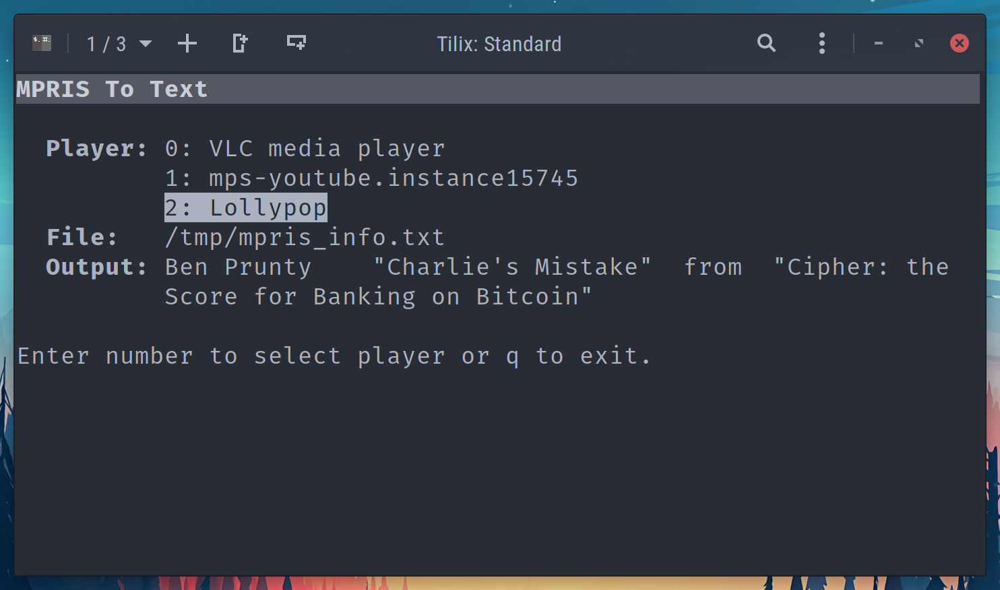

# MPRIS To Text

A Python script that fetches media data from MPRIS-compliant media players and saves it into a text file.

## Required packages

- [blessed](https://github.com/jquast/blessed): Terminal UI

## Parameters

- `-h`: Display help
- `--file`: Full path to the file the data is written into
- `--format-artist`: Format string for the artist part
- `--format-title`: Format string for the title part
- `--format-album`: Format string for the album part
- `--format`: Format string that puts all parts together
